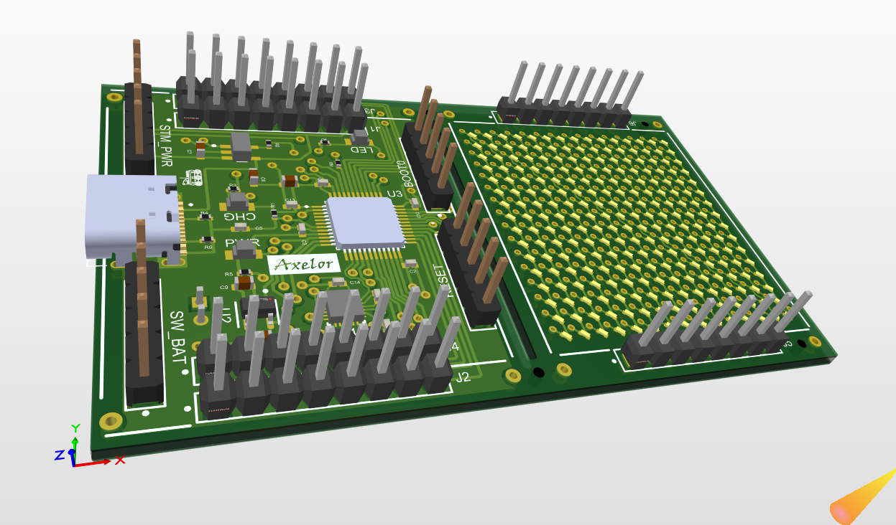
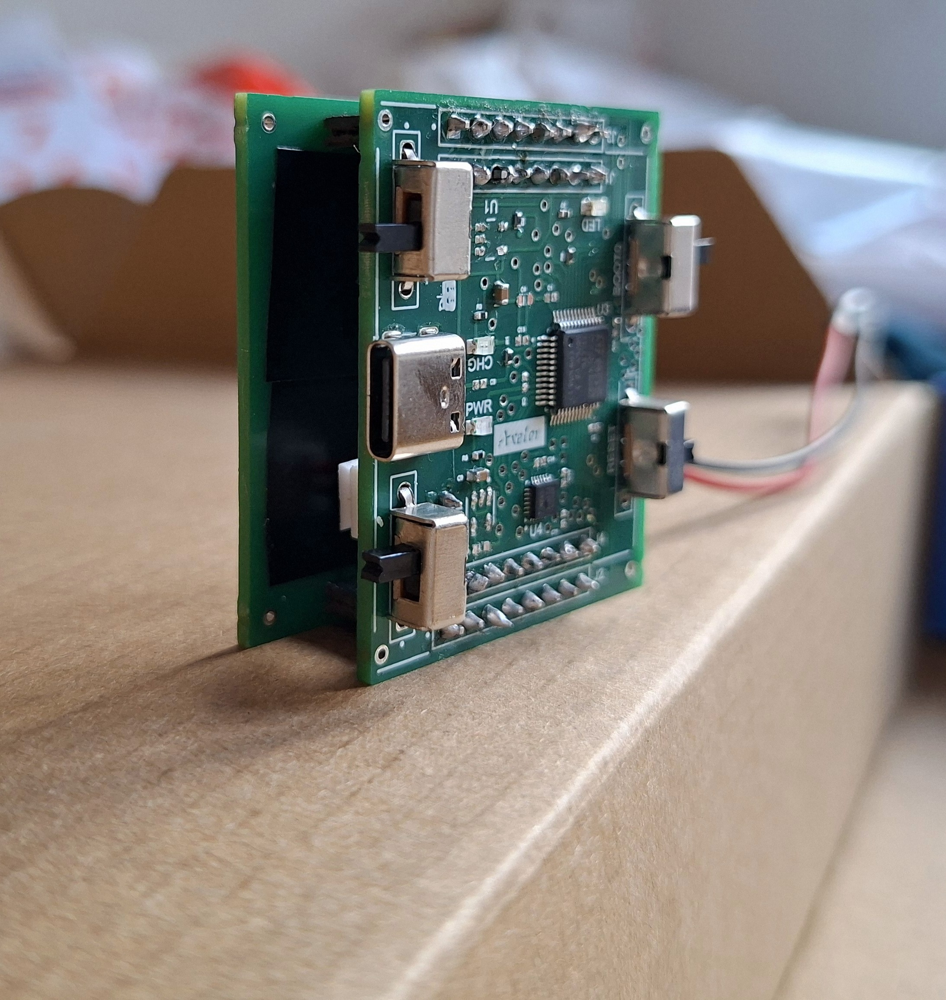
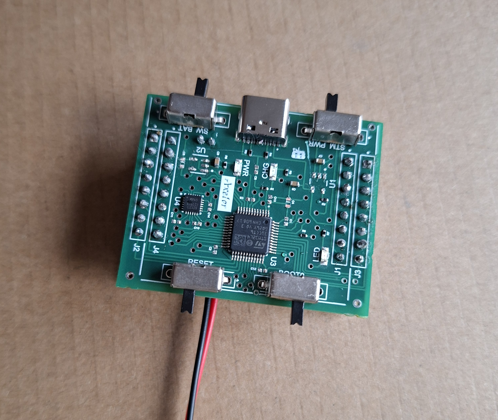

# Fluid Simulator

A real-time FLIP/PIC fluid simulation, ported from browser, to desktop, to bare-metal
firmware, that reacts to how you tilt or move the device — an onboard accelerometer drives
simulated gravity, and the result is rendered live on a 16-row x 15-column charlieplexed
LED matrix.

  
  

## Contents

- [About](#about)
- [Simulation](#simulation)
- [PCB](#pcb)
- [STM32 Firmware](#stm32-firmware)
- [Hardware](#hardware)
- [Photos](#photos)
- [Acknowledgments](#acknowledgments)
- [License](#license)

## About

This started from a simple question: can the exact same fluid-physics code run identically
in a browser, on a desktop, and on a microcontroller with no FPU budget to spare? The answer
shaped the repo — one physics core, three increasingly constrained environments, each one
validating the next before any soldering happened.

Full spec, design decisions, and round-by-round build history:
`specs/001-multi-stage-fluid-sim/`.

## Simulation

The fluid physics is written once and reused, unmodified in behavior, across two software
stages before it ever touches hardware:

- **[`simulators/web_simulator/`](simulators/web_simulator/)** — JavaScript browser
  prototype. Open the HTML file directly, no build step. Fastest loop for tuning physics and
  visuals.
- **[`simulators/windows_desktop_simulator/`](simulators/windows_desktop_simulator/)** — C
  port of the same physics core, rendered at the final 16x15 grid resolution, built with
  MinGW or Docker. Validates the simulation on a desktop PC before it's ported to the
  firmware.

Each folder has its own README with exact build/run commands.

## PCB

Board name: **Axelor**. Designed in Altium Designer — a USB-C powered main board plus a
diagonally-charlieplexed 16x15 LED matrix board.

   
   
  
  

- **[`pcb/altium_project/`](pcb/altium_project/)** — Altium Designer project (schematic +
  PCB layout), packaged with Altium's Project Packager.
- **[`pcb/jlc_order/`](pcb/jlc_order/)** — Gerbers, BOM, and CPL files as submitted to
  JLCPCB for fabrication.

Key components (full BOM in [`pcb/jlc_order/axelor_pcb-BOM.csv`](pcb/jlc_order/axelor_pcb-BOM.csv)):

| Ref | Part | Role |
|---|---|---|
| U3 | STM32L431CCT6 | MCU — Cortex-M4, 256KB flash |
| U4 | MPU-6500 | 3-axis accelerometer/gyro (I2C) |
| U2 | TPS7A0233PDBVR | 3.3V LDO regulator |
| U1 | MCP73832T-2ACI/OT | Li-ion/Li-poly charge controller |
| PWR_IN1 | USB Type-C receptacle | Power input |
| D1-D240 | 0402 blue LEDs | 16x15 charlieplexed display |

## STM32 Firmware

- **[`stm_project/axelor/`](stm_project/axelor/)** — STM32CubeIDE project for the Axelor
  board (STM32L431CCTx). Reads the onboard accelerometer and drives the simulation's physics
  core — unmodified in behavior from the Windows simulator — onto the real charlieplexed LED
  matrix.

## Hardware

- MCU: STM32L431CCTx (STM32L4 series, Cortex-M4, 256KB flash)
- Display: 16-row x 15-column charlieplexed LED matrix (240 LEDs)
- Sensor: MPU-6500 accelerometer/gyro, used as the simulation's gravity vector
- Power: USB-C input, MCP73832 Li-ion charger, TPS7A02 3.3V LDO rail

## Photos

  
  
  
  

More build, bring-up, and debugging photos in [`media/photos/`](media/photos/).

## Acknowledgments

- **[mitxela's "Fluid Simulation Pendant"](https://mitxela.com/projects/fluid-pendant)**
  ([Hackaday writeup](https://hackaday.com/2025/01/13/fluid-simulation-pendant-teaches-lessons-in-miniaturization/),
  [Hackaday.io](https://hackaday.io/project/205649-fluid-simulation-pendant)) — the direct
  inspiration for this project's overall architecture (FLIP simulation + charlieplexed
  matrix + accelerometer, on the same STM32L4 family).
- **[Matthias Müller's tenMinutePhysics FLIP tutorial](https://matthias-research.github.io/pages/tenMinutePhysics/18-flip.html)**
  — the FLIP/PIC algorithm this project's `flip_fluid.c`/`flip.js` are ported from.
- Select component footprints/3D models sourced from **SnapEDA**.

## License

No license has been chosen yet for this repository's own code/hardware design. Bundled
ST CMSIS/HAL driver files under `stm_project/axelor/Drivers/` retain their own respective
licenses (see the `LICENSE.txt` files in those folders).
